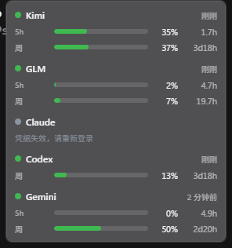
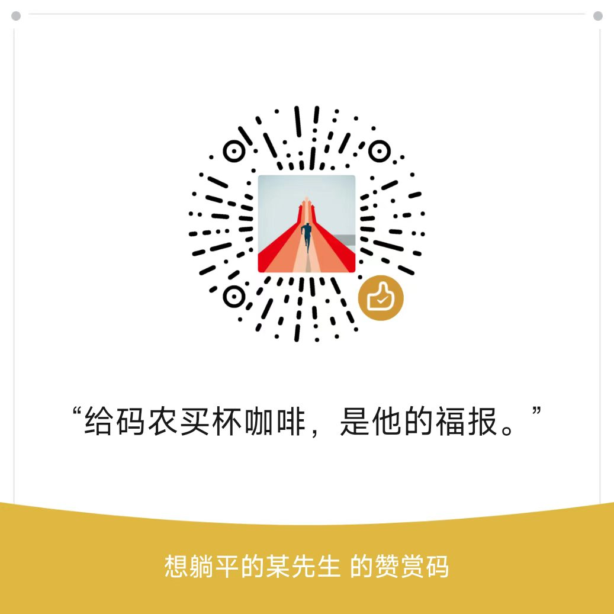

# QuotaBar

> **EN**: A tiny acrylic bar that lives on your Windows desktop and tells you exactly how much of your Claude / Kimi / Codex / GLM / Gemini quota is left — before the 429 does. Open source (MIT), zero telemetry, credentials never leave your machine. [Quick Start](#安装).



**每个同时订阅了五家 AI 的人，都值得拥有一条额度版「血条」。**

你经历过这种绝望吗：代码写到心流正酣，Claude 突然 429。你愣住，打开网页，登录，找到用量页——5 小时窗口用了 98%，重置还有 41 分钟。好，这 41 分钟你什么也干不了，只能盯着屏幕反思人生。

QuotaBar 就是为这个瞬间生的。它常驻桌面角落，把五家的 5 小时窗口、每周额度、重置倒计时摊在你眼前。**被限流之前，你先看到它。** 

---

## 目录

1. [功能特性](#功能特性)
2. [支持平台](#支持平台)
3. [安装](#安装)
4. [首次运行](#首次运行)
5. [凭据行为清单](#凭据行为清单安全核心)
6. [工作原理](#工作原理)
7. [自定义监视引擎](#自定义监视引擎开放框架)
8. [卸载与清理](#卸载与清理)
9. [FAQ](#faq)
10. [它不是什么](#它不是什么非目标)
11. [请作者喝咖啡](#请作者喝咖啡)

---

## 功能特性

- **悬浮条常驻桌面**：半透明 acrylic、置顶、整面拖动、**永不抢焦点**——在 VS Code 里打字时拖它，光标纹丝不动（这是血泪换来的 `WS_EX_NOACTIVATE`，不是吹的）
- **5 小时窗口 + 每周窗口 + 重置倒计时**：`43m / 2.1h / 3d4h`，扫一眼就知道现在该猛用还是该省着
- **颜色告警**：绿 <70% → 黄 70-90%（带斜纹，色盲友好）→ 红 >90%。整条边框还会跟着变色，眼角余光就能感知
- **Toast 提醒**：跨过 90% 叫你一声「要没了」；窗口重置时叫你一声「已重置，放开用」。就这两句，不多嘴
- **迷你模式**：收成一条 22px 细条，左边是最紧张的那家用量，右边轮播程序员段子（深夜会自动切换成「该睡了」模式）
- **凭据自动发现**：装了官方 CLI 就零配置出数。它自己读凭据、自己刷新 token、自己写回——和官方 CLI 一个姿势，不搞特殊
- **自定义监视引擎**：任何「一个 GET 返回 JSON」的平台，设置里填四个框就能接入，不用写一行代码
- **零遥测**：不联网汇报任何东西。它唯一会「说出去」的，是你手动复制的诊断信息（而且先过脱敏层）

## 支持平台

| 平台 | 凭据来源 | 轮询 | 备注 |
|---|---|---|---|
| **Kimi** | 自动读 `~/.kimi-code/credentials/kimi-code.json`，或 Console API key | 2min | Kimi CLI 自家接口，稳 |
| **GLM 智谱** | 手动粘 API key（进 Windows 凭据管理器） | 2min | 国内/国际双端点自动试，积分制套餐也认 |
| **Codex** | 自动读 `~/.codex/auth.json`（OAuth 刷新） | 2min | Codex CLI 自用接口 |
| **Claude** | 自动读 `~/.claude/.credentials.json`（OAuth 刷新写回） | **10min** | 非官方接口，频控敏感，轮询慢是故意的，别催 |
| **Gemini** | 自动读 `~/.gemini/oauth_creds.json`，或 **Antigravity IDE** 的本地语言服务器（IDE 开着时数字和它的面板一模一样） | 5min | 两条通道自动选 |
| **自定义** | 设置页配置 | ≥1min | 见下文开放框架 |

没装的 CLI 那一行不会出现；哪家接口挂了，只有那行变灰，别家照常——**不把鸡蛋的崩溃放在一个篮子里**。

## 安装

### 下载（推荐）

[GitHub Releases](https://github.com/kimhero110/desktoken/releases)：

- **`QuotaBar_x64-setup.exe`** —— 安装包（自动处理 WebView2）
- **`quotabar.exe`** —— 绿色单文件，扔哪儿跑哪儿

国内下载慢：链接前面拼你常用的 GitHub 加速镜像即可，文件在 Release 附件里，镜像站通用。

**SmartScreen 那一拦**：没买几百刀一年的签名证书，所以 Windows 会装模作样地保护你一下。点「更多信息」→「仍要运行」。不放心的同学：每个 Release 带 `checksums.txt`（SHA-256）和 GitHub 官方构建证明（Attestations），可核对这文件确实是 CI 从源码编的，不是谁半夜传的。

### 从源码构建

```bash
git clone https://github.com/kimhero110/desktoken.git
cd desktoken/src-tauri
cargo tauri dev      # 开发模式
cargo tauri build    # 出安装包
```

要求：Rust stable + Windows 10/11。

## 首次运行

第一次启动会弹一个**知情同意**对话框。在你点「同意」之前，程序**不发任何网络请求**——欢迎开抓包工具监督。

大意是：它用你本机 CLI 的登录凭据去轮询各家非官方用量接口，理论上违反平台 ToS（保守轮询把风险压到很低）；token 过期会自动刷新写回；数据全在你本机。同意就开工，不同意就退出，不纠缠。

## 凭据行为清单（安全核心）

这章不好笑，因为凭据不是笑话。逐条列清，**欢迎抓包验证**：

| 行为 | 明细 |
|---|---|
| **读取的文件** | `~/.kimi-code/credentials/kimi-code.json`、`~/.codex/auth.json`、`~/.claude/.credentials.json`、`~/.gemini/oauth_creds.json` |
| **读取的凭据管理器条目** | `gemini:antigravity`（Antigravity 存的 Google 凭据，**只读**，从不写入） |
| **唯一写回场景** | OAuth token 过期时换新并写回**同一个文件**。写回前做 compare-before-write：若官方 CLI 刚好也在刷新，采用它的，丢弃我们的——绝不抢方向盘 |
| **手动 API key** | 只进 Windows 凭据管理器（服务名 `quotabar`），绝不落盘 |
| **触达域名全表** | `api.kimi.com`、`auth.kimi.com`、`open.bigmodel.cn`、`api.z.ai`、`chatgpt.com`、`auth.openai.com`、`api.anthropic.com`、`console.anthropic.com`、`cloudcode-pa.googleapis.com`、`daily-cloudcode-pa.googleapis.com`、`oauth2.googleapis.com`、`api.github.com`、`github.com`（版本检查）。**多一个都没有** |
| **绝不发送** | 凭据永不出这台机器；没有分析、没有崩溃上报、没有遥测 |

日志在 `%APPDATA%\quotabar\spike.log`，落盘前过统一脱敏层。你要是还不放心——源码就在这儿，编译它。

## 工作原理

- **轮询**：每家一个独立任务，启动即取数，然后按上表节奏；系统睡醒了自动错峰全量刷新（不会因为补发风暴把你限流）
- **失败隔离**：一家解析挂了只灰那一行。别家不陪葬
- **429 退避**：遵从 Retry-After，指数退避封顶 8 倍周期，加 ±20% 抖动（不跟大家挤同一秒重试）
- **宽容解析**：接口字段缺了、类型变了，能解就解；解不了就老实说「接口变更，请检查更新」，而不是显示一堆 NaN
- **OAuth 写回六步协议**：重读 → 临过期 5 分钟才刷 → 单飞锁 → compare-before-write → 原子改名重试 6 次 → 写不进就用内存里的，反正不丢你的登录态

## 自定义监视引擎（开放框架）

设置 → 自定义监视 → 四个框：

- 端点 URL（一个 GET 返回 JSON 额度）
- 认证头名 + 前缀（如 `Authorization` + `Bearer `）
- 窗口映射：`标签 | used 路径 | limit 路径 | reset 路径(可选)`，点语法 `data.usage.used`，支持数组下标
- 轮询间隔

reset 字段自动识别 epoch 秒/毫秒/RFC3339。接进来就和内置五家同等待遇：同样的渲染、同样的告警、同样的失败隔离。

## 卸载与清理

天下没有不散的额度。要删的话：

- 设置与状态：`%APPDATA%\quotabar\settings.json`
- 日志：`%APPDATA%\quotabar\spike.log`
- 手动 key：凭据管理器里服务名 `quotabar` 的条目
- 开机自启：设置里关（注册表 `HKCU\...\Run\QuotaBar`）

删完这些就干净了。Antigravity 的凭据条目我们不动——那是人家的东西，借读已是承情。

## FAQ

**Q: 数字准吗？**
悬浮条 tooltip 里标了来源。Kimi 对照 CLI `/usage`，Codex 对照 CodexBar，Gemini 对照 Antigravity 面板（同源数据，一个字不差）。轮询有间隔，几分钟内的差异属于物理学。

**Q: 杀软报毒？**
未签名 + 读凭据文件，启发式引擎难免紧张。Defender 实测通过。遇到报毒：对 `checksums.txt`，或者自己从源码编一个——这是最彻底的信任。

**Q: 怎么更新？**
右键 → 检查更新。有新版本时悬浮条顶部出黄色横幅，可以「跳过此版本」。绿色 exe 下载替换即可，安装包覆盖安装保留设置。

**Q: Claude 为什么 10 分钟才刷一次？**
因为它的用量接口是非官方的、频控敏感的。慢是功能，不是 bug。

**Q: Gemini 显示「Antigravity 未运行」？**
打开 Antigravity IDE 就行。它读的是 IDE 本地语言服务器的实时数据，IDE 不在线就没有可信数字——我们选择诚实，不给你编一个。

**Q: 迷你模式右边那些话是什么？**
程序员段子库 + 时段关怀。深夜会劝你睡觉，周五下午会劝你别开新坑。别嫌弃，它比你的项目经理关心你。

## 它不是什么（非目标）

为防止范围蔓延（和自己的手贱），以下永远不做：

- 内置遥测/崩溃上报
- 账号切换器（那是 cc-switch 的地盘）
- Web 版 / 浏览器扩展
- 凭据跨工具双向同步

## 请作者喝咖啡

如果这个工具帮你躲过了一次「心流被 429 掐死」的绝望瞬间，可以考虑请作者喝杯咖啡：

<p align="center">
  
</p>

<p align="center"><i>给码农买杯咖啡，是他的福报。</i></p>

完全自愿，不给也能用全部功能——开源软件不兴赎金那一套。

---

## Contributing

欢迎 issue 和 PR。两条规矩：

1. **提交前跑 `cargo test`**（src-tauri 目录）
2. **发版用 `release.ps1`**：`powershell -File release.ps1 patch`（bump → 测试 → tag → CI 一条龙，别手工同步版本号，会乱）

License: [MIT](LICENSE)
